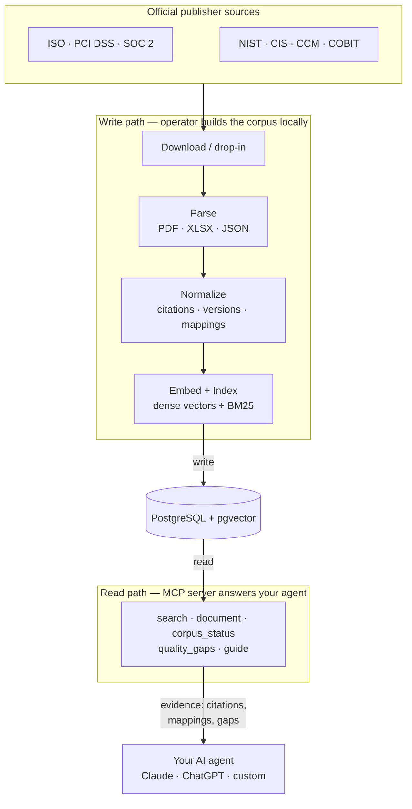

<div align="center">

# compliary

**Evidence-only corpus + MCP server for InfoSec control frameworks.**

Exact control citations, version lineage, cross-framework mappings, provenance, and explicit
gaps -- served to your agent over MCP. compliance + library.

[](LICENSE)
[](https://modelcontextprotocol.io)
[](PLAN.md)
[](https://github.com/dannyota/compliary/actions/workflows/ci.yml)
[](https://go.dev)
[](https://www.postgresql.org)

</div>

---

compliary ingests InfoSec and cybersecurity control frameworks from their **official publisher
sources** and normalizes them into a citable knowledge base -- one corpus, one database, framework
as a registry dimension. It returns **evidence, never answers**: your agent connects over MCP,
retrieves citations and mappings, and decides the answer itself.

Built for compliance and GRC engineers wiring AI agents to citable framework evidence --
ISO 27001, SOC 2, PCI DSS, NIST CSF, NIST 800-53, CIS Controls, and more.

Sibling of [banhmi](https://banhmi.danny.vn) (binding law per jurisdiction).
Design: [docs/ARCHITECTURE.md](docs/ARCHITECTURE.md). Roadmap: [PLAN.md](PLAN.md). Deploy: [docs/OPERATIONS.md](docs/OPERATIONS.md).

## How it works



## MCP tools

| Tool | Purpose |
|------|---------|
| **guide** | Playbook: scope, citation forms, query tips, evidence contract |
| **corpus_status** | Live per-framework/version counts and coverage |
| **search** | Hybrid retrieval (dense + BM25, RRF-fused); optional framework/version filter |
| **document** | Citation lookup: control body, mapping edges, version lineage, chunks |
| **quality_gaps** | Known corpus gaps, unresolved mappings, eval floors |

An agent calls `guide` first, then `search` or `document` for evidence, and `quality_gaps` to
learn what the corpus cannot answer. Full contract: [docs/design/MCP.md](docs/design/MCP.md).

## Frameworks

11 frameworks / 3,402 controls / 4,462 mapping edges (94.8% resolved) / 1,718 curated titles.

| Source access | Ingestion | Frameworks |
|---|---|---|
| **Public / direct** | auto-fetch | NIST CSF 2.0, NIST SP 800-53 r5 (OSCAL), CIS Controls v8.1 |
| **Free, form-gated** | `cmd/fetch` fills the click-through with the operator's identity | PCI DSS v4.0.1 |
| **Sign-in / purchase** | manual drop-in into `data/` | SOC 2 (AICPA TSC), ISO/IEC 27001, 27002, 27017, 27018, 27701, ISO 22301, ISO/IEC 42001, SWIFT CSCF, COBIT 2019, CSA CCM v4.1 |

## Retrieval quality

Adversarially-verified eval on a 175-case golden set:

| Lane | Recall@8 | MRR@8 | Current-version | Abstention |
|------|----------|-------|-----------------|------------|
| Open-corpus | 83.8% | 62.4% | 100% | 95.4% |
| Framework-filtered | 91.9% | 80.1% | 100% | 94.9% |

Accepted floors gate every corpus change. The `quality_gaps` tool serves these numbers live.

## Quickstart (self-deploy)

Prerequisites: Go 1.26+, Podman or Docker.

```bash
# 1. Clone
git clone https://github.com/dannyota/compliary.git
cd compliary

# 2. Start Postgres (port 10011)
podman compose -f deploy/compose/compliary.yaml up -d

# 3. Migrate + seed the config registry
go run ./cmd/migrate
go run ./cmd/seed

# 4. Acquire documents
#    Public sources (NIST, CIS):
go run ./cmd/fetch
#    Form-gated (PCI DSS): cmd/fetch fills the publisher form with your identity from .env
#    Everything else: download from the publisher and drop into data/

# 5. Run the pipeline
go run ./cmd/pipeline -stage manifest
go run ./cmd/pipeline -stage extract
go run ./cmd/pipeline -stage normalize
go run ./cmd/pipeline -stage mapedges
go run ./cmd/pipeline -stage index       # bulk embed (Kaggle T4 when KAGGLE_API_TOKEN set)
go run ./cmd/pipeline -stage lexindex

# 6. Connect an agent
#    stdio (local, full projection):
go run ./cmd/mcp
#    Streamable HTTP:
go run ./cmd/server
```

## Licensing and data trust

Most framework documents are copyrighted; compliary never redistributes them.

- **The repo ships code + metadata only** -- never licensed document text.
- **Each operator builds their own corpus** locally, under licenses they accepted.
- **Official publisher sources only** -- never pirated, leaked, or third-party re-hosted copies.
  Every document carries license provenance (source URL, license kind, retrieval date).
- **Licensed text is served privately only.** The maintainer's instance at `compliary.danny.vn`
  has an `/mcp` endpoint **authenticated for the maintainer alone** (OAuth 2.0); unauthenticated
  requests receive 401. Anyone else self-deploys.
- **Version lineage is first-class** -- supersession relations (`27001:2013 -> :2022`,
  `CSF 1.1 -> 2.0`) are tracked; superseded text is never presented as current.

## License

[Apache 2.0](LICENSE) -- covers this repository's code and metadata only. Framework documents
ingested at deploy time remain under their publishers' licenses.
