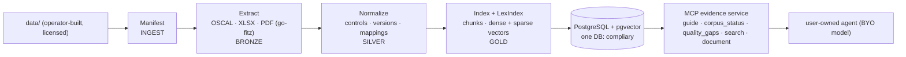

# compliary architecture

compliary is an **evidence-only corpus + MCP server** for **InfoSec & cybersecurity control
frameworks** — one corpus, one DB, framework as a **registry dimension** (sibling of banhmi, which is
corpus-per-country). It ingests each framework from its official publisher file, normalizes it into a
citable knowledge base — exact control citations (`A.5.1`, `AC-2(3)`, `CC6.1`, `Req 8.3.6`,
`PR.AA-01`, `EDM01`), version lineage, cross-framework mappings, provenance, license posture, and
coverage gaps — and serves that evidence over **MCP**.

**compliary does not answer questions.** A user-owned agent connects over MCP, retrieves evidence,
and decides the answer itself. No built-in answer LLM, ever.

Conventions live in [`CLAUDE.md`](../CLAUDE.md); roadmap in [`PLAN.md`](../PLAN.md). This doc is the
system overview; the data model is in [`design/SCHEMA.md`](design/SCHEMA.md).

## Design principles (ported from banhmi, adapted)

| Principle | What it means here |
|-----------|--------------------|
| **Evidence-only, MCP-first** | Tools expose citations, versions, mappings, provenance, gaps. The user's model answers. |
| **Data accuracy is the product** | Exact control text and IDs; deterministic extraction; no AI as the canonical parser. |
| **License provenance is first-class** | Every document row carries source URL, license kind, retrieval date, and a **serve gate** — licensed text is served only on an authenticated private instance. The repo never ships document text. |
| **Static corpus, not a crawl** | ~15 frameworks, ~25 files, updated a few times a year. Ingestion is a **file manifest** over `data/`, not a discovery crawler — no cursors, no leases, no watermarks. |
| **Version validity is first-class** | `27001:2013 → :2022`, `27018:2019 → :2025`, `CSF 1.1 → 2.0`, `PCI 4.0 → 4.0.1` are supersession relations. Superseded text is served flagged, never as current. |
| **Framework = registry dimension** | A framework descriptor (config-seeded) selects source access, parser, citation scheme, version lineage. No hardcoded framework lists in Go. |
| **Hybrid retrieval** | Dense Qwen3-Embedding + BM25 `sparsevec`, RRF-fused, one datastore (PostgreSQL + pgvector). Same stack as banhmi. |
| **Corpus language: English** | The frameworks' publication language. No translation of normative text. |

## What is deliberately simpler than banhmi

banhmi crawls tens of thousands of documents from live government sources; compliary ingests a
couple dozen static publisher files the operator already placed in `data/`. Dropped wholesale:
discovery cursors/keywords, crash-safe artifact leases, dead-letter queues, re-check schedules,
OCR (no-OCR policy: normative text is never OCR-reconstructed), gazette/alias reconcile, and the
scope matcher. The `ingest` schema shrinks to a **file manifest + per-file pipeline state**.

## Sources

Registry with per-framework access verdicts in [`PLAN.md`](../PLAN.md) (scope table). Three access
classes (`source_access`): `auto-fetch` (NIST, CIS), `form-gated` (PCI SSC — `cmd/fetch` fills the
click-through as the operator), `byo` (ISO, AICPA, CSA, ISACA, SWIFT — manual drop-in). File formats
actually in hand: **OSCAL JSON** (SP 800-53), **XLSX workbooks** (CSF, CIS, CCM/CAIQ), **born-digital
PDF** (everything else). All text-parseable; no scans (rejected at acquisition).

## Data architecture (Medallion, five schemas)

Full model in [`design/SCHEMA.md`](design/SCHEMA.md).

| Layer | Schema | Contents |
|-------|--------|----------|
| Ingest | `ingest` | File manifest over `data/`: one row per file, sha256, pipeline state per stage. Completeness = every manifest row parsed, recomputed not flagged. |
| Bronze | `bronze` | Raw capture: source file metadata + license provenance (source URL, license kind, retrieval date, provenance note) + extracted raw text/structures per file. |
| Silver | `silver` | Normalized: framework → version → document → **control** tree (citation-keyed), version supersession relations, **cross-framework control mappings** with per-edge provenance. |
| Gold | `gold` | Chunks (one control → one chunk, contextual prefix) + dense embeddings + BM25 sparse vectors. |
| Config | `config` | The **framework registry** + citation schemes + mapping-source vocab, seeded from `deploy/seed/*.csv`, `origin='seed'`/`'user'` overrides (banhmi's re-seed pattern). |

## Pipeline

`cmd/pipeline` with direct stage calls (no orchestrator), reusing banhmi's stage shape minus
crawling. Stages: **Manifest** (scan `data/`, hash, classify via `config.file_rule`, diff against
`ingest`) → **Extract** (per file: OSCAL JSON / XLSX / PDF via go-fitz) → **Normalize** (per
framework version: control tree, citations, version + mapping relations) → **Index** (chunks +
embeddings; bulk embed on Kaggle T4 like banhmi) → **LexIndex** (BM25 sparse vectors).

**Landed:** Manifest (all 26 corpus files classified — 23 matched / 3 ignored), Extract (OSCAL JSON
+ XLSX), Normalize (NIST SP 800-53 r5 + NIST CSF 2.0 + CSF informative-reference mappings + CIS
Controls v8.1 + CSA CCM v4.1 — see PLAN.md milestone history for validated numbers). All XLSX
parsers complete. **Next:** PDF extractors + parsers per SCHEMA.md order, then Index/LexIndex.



## MCP — the product surface

Same five-tool contract as banhmi: `guide`, `corpus_status`, `quality_gaps`, `search`, `document`.
Each hit carries the exact control citation, framework + version (with superseded flag), mapping
edges (as relations, not text), license/provenance, and explicit gaps. Framework-domain additions:

- **`search` takes an optional `framework` / `version` filter** — default searches current
  versions only; superseded editions are queryable only by explicit pin (the version-lineage
  promise, deliverable through MCP).
- **`document` with a citation returns the control + its `control_mapping` edges** ("maps to:
  ISO 27001:2022 A.5.15, CIS 6.5") — mapping traversal without a new tool.

stdio for local clients, Streamable HTTP for the deployed instance; evidence logic in shared
packages, not surfaces. **Maintainer instance (`compliary.danny.vn/mcp`) requires auth** —
licensed text is never served publicly (mechanism decided at M4; see PLAN.md open decisions).

## Repository layout

```text
compliary/
├── cmd/
│   ├── fetch/             # one-shot corpus downloader
│   ├── pipeline/          # manifest/extract/normalize/index/lexindex stages
│   ├── mcp/               # MCP server (stdio)              [target]
│   ├── server/            # Streamable-HTTP /mcp             [target]
│   ├── migrate/           # DB migrations
│   ├── seed/              # load config registry from deploy/seed/*.csv
│   └── eval/              # retrieval eval (recall@k/MRR@k)  [target]
├── pkg/
│   ├── base/              # config, db, log
│   ├── fetch/             # per-publisher fetchers
│   ├── operator/          # operator identity (.env)
│   ├── manifest/          # data/ scanner + file_rule matcher
│   ├── extract/           # OSCAL JSON + XLSX extractors (PDF: target)
│   ├── normalize/         # NIST 800-53 + CSF 2.0 + CIS v8.1 + CCM v4.1 → silver (PDF parsers: target)
│   ├── rag/               # embed, hybrid retrieve            [target]
│   ├── mcp/               # MCP tools over the shared query core [target]
│   └── store/             # generated sqlc (do not hand-edit)
├── sql/                   # sqlc schema.sql + queries.sql per schema
├── deploy/                # migrations, seed CSVs, Containerfiles
└── docs/                  # this doc + design/
```

## Technology stack

Same as banhmi except where noted: Go (module `danny.vn/compliary`), PostgreSQL 17 + pgvector
(single `compliary` DB), sqlc, Atlas→goose migrations, go-fitz extraction (**no OCR engine at
all**), Qwen3-Embedding-0.6B ONNX (Kaggle bulk / in-process queries), official Go MCP SDK,
Apache 2.0 (code only — corpus stays operator-local).

**Embedder strategy (settled):** the maintainer's deployed instance **shares banhmi's
embedder** (same Qwen3 model + infra, one embedding service for both products — wiring decided
at M4). **Self-deployers stay self-contained:** the embed/lexindex/retrieve code is **copied
from banhmi into this repo** when the Index stage lands (same author for both; copy, not a
module dependency — the ported-patterns doctrine unchanged).

## Settled decisions

1. **No crawler** — the ingest layer is a file manifest over `data/`; re-runs diff by sha256.
2. **No OCR** — a file without a text layer is rejected at acquisition (PLAN.md phase-2 note).
3. **One DB** — framework is a column (registry FK), not a database.
4. **Registry in `config`** — frameworks/versions/citation schemes seeded from CSVs, never Go lists.
5. **Serve gate per document** — license class decides public metadata vs auth-only text.
